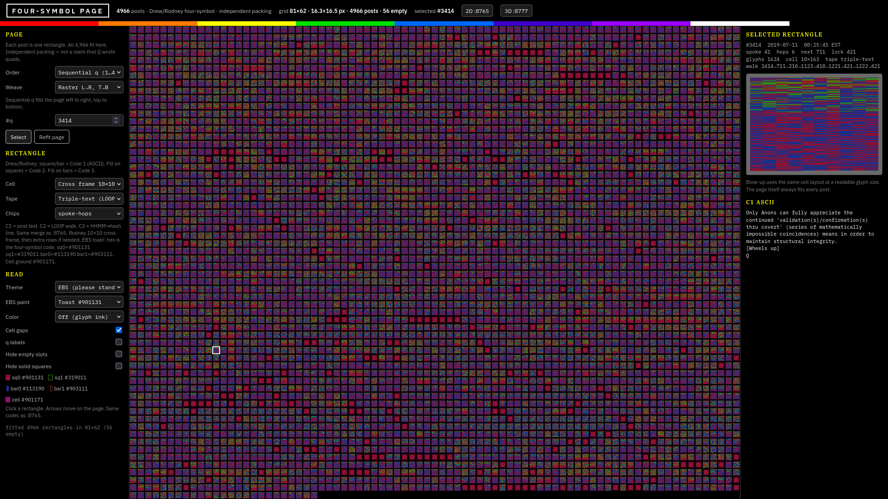
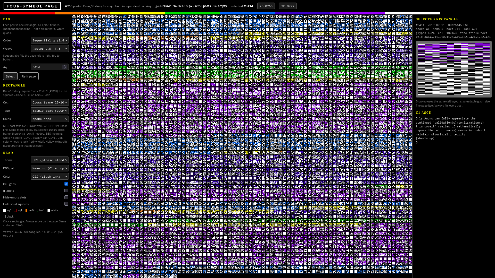

# Four-symbol page

[](LICENSE)
[](#run-it)
[](#the-corpus)
[](https://github.com/ogdonny/qclock-quads-page/actions/workflows/test.yml)

**Live demo:** [ogdonny.github.io/qclock-quads-page](https://ogdonny.github.io/qclock-quads-page/)

One canvas. Every Q post as its own Drew/Rodney rectangle. All **4,966** fit on a single page.

This is an **independent packing** of a public catalog — not a claim that Q wrote quads.

EBS toast (glyph = hex) and EBS meaning (square/bar + hops rainbow) of the same tape:





Open those views directly:

- [Toast](https://ogdonny.github.io/qclock-quads-page/#q=3414&tape=triple-text&cell=cross&theme=ebs&paint=toast)
- [Meaning](https://ogdonny.github.io/qclock-quads-page/#q=3414&tape=triple-text&cell=cross&theme=ebs&paint=meaning)

---

## What you are looking at

Each cell on the page is one post (`q = 1 … 4966`). Inside that cell is a **tape**: the post’s text, plus optional extra channels, drawn with four marks.

Click a rectangle. The right rail blows the same tape up to a readable size and prints the recovered C1 ASCII. Arrow keys walk the page.

---

## The four marks

Drew / Rodney fashion, same merge as the 2D replica on `:8765`:

```
C1 bit    extra    glyph     drawing
0         0        sq0       filled square
0         1        sq1       hollow square
1         0        bar0      filled vertical bar
1         1        bar1      hollow / double vertical bar
```

Two channels, one mark:

1. **Shape** encodes Code 1 (the ASCII bitstream of the post). Square = `0`, bar = `1`.
2. **Fill** encodes the extra bit. Solid = `0`, hollow = `1`.
   - Extra on squares is Code 2.
   - Extra on bars is Code 3.

Space bytes (`00100000`) pad Code 1 until there are enough zeros for Code 2 and enough ones for Code 3. Encode and decode are lossless for the ASCII that survives the fold (smart quotes / dashes collapse to ASCII; code points `> 255` become `?`).

Default tape is **C1 ASCII (full post)** — eight glyphs per character, left to right, top to bottom. Long posts squeeze more rows into the same rectangle so the *page* still holds every post.

**Triple-text** (the views in the screenshots): C1 = post text, C2 = LOOP walk, C3 = HHMM→hash line. Same merge as `:8765`.

---

## EBS paints

Theme **EBS** (“please stand by”) has three paints. These are overlays. They do not change the tape.

| Paint | What you see |
| --- | --- |
| **Meaning** | C1 white/black (filled square white, filled bar black). Hollow marks take the hops rainbow. |
| **Spectrum** | Every glyph walks ROYGBIV + white + black. Cell band follows the header stripe. |
| **Toast** | Four-symbol hex: sq0 `#901131` · sq1 `#319011` · bar0 `#113190` · bar1 `#903111`. Cell ground `#901171`. |

Other themes: Phosphor (CRT lime), Volt, Magma, Ion, Paper, Oak.

---

## Date-hash / LOOP (why 421)

Every post has a calendar date. The **date-key** is EST `MM/DD` with the leading month zero dropped (`2017-12-22` → `1222`). If that number is itself a post index, the catalog walks there. The unique 2-cycle is:

```
421  ↔  1222
```

Depth is at most 6. There is no second sink. Display timezone and hash timezone are both `America/New_York`.

| Fact | Value |
| --- | --- |
| Posts | 4,966 |
| Unique dates | 533 |
| First / last | 2017-10-28 → 2022-11-27 |
| Epoch used in the replica | 2017-12-07 |
| Lock pair | 421 ↔ 1222 |
| Lock spoke | 15 |
| Max hops to lock | 6 |

The page can also color cells by hops-to-lock, AM/PM, or which basin the walk falls into (`Color` in the left rail). Those paints are overlays too.

---

## Controls

**Page order** — how the 4,966 rectangles are sequenced onto the grid:

| Order | Meaning |
| --- | --- |
| Sequential q | `1 … 4966` |
| Timestamp | Chronological EST stamps |
| Replica date | Unique posting date, then q |
| Spoke | Clock spoke 0–59 |
| Hops to lock | Depth to 421↔1222, shallow first |
| Time face | Hour, then minute, then second |
| Date × minute | 60×60 layout flattened |
| Spoke 15 first | Lock chapter, then the rest |
| Lock basin | Walks that cadence onto 421, then 1222 |
| AM / PM, even/odd q, LOOP depth, walk-first-visit | as labeled |

**Weave** — how that sequence fills the page: raster, boustrophedon (ox-plow), spiral (outer → in), columns.

**Cell packing** — how one post’s tape is laid out *inside* its rectangle: 8-wide byte rows, 32-wide notebook, column-major, boustrophedon, square spiral, weeks (7), nearest square, 8×14 fish frame, 10×10 cross frame.

**Tape:** C1 ASCII (full post) · triple-text (LOOP + stamp as extra channels) · head 8 bytes · field chip (`spoke-hops` / `ampm-lock` / `even-q` / `timehash`).

**Toggles:** cell gaps · q labels · hide empty leftover slots · hide solid squares (image-only / blank posts such as 544 and 550).

State is stored in the URL hash, so a view is shareable:

```
index.html#q=3414&tape=triple-text&cell=cross&theme=ebs&paint=toast
index.html#q=421&order=basin&theme=phosphor
```

---

## Run it

No build step. Python 3 is only the local server (and the tests).

```bash
git clone git@github.com:ogdonny/qclock-quads-page.git
cd qclock-quads-page
python3 -m http.server 8558 --bind 127.0.0.1
```

Then open [http://127.0.0.1:8558/](http://127.0.0.1:8558/).

`./serve.sh` does the same thing, and on this machine will prefer the systemd unit `qclock-quads-page.service` if it is installed.

Or skip the clone and use the [live GitHub Pages demo](https://ogdonny.github.io/qclock-quads-page/).

---

## Tests

```bash
python3 tests/page.py
```

Locks fit / weave / Drew cell packing, toast hex, hide-empty / hide-solid, and the 4,966 sequential catalog.

---

## Repository map

```
index.html                 four-symbol page
css/page.css               CRT chrome + themes (including EBS toast hex)
js/quads.js                four-symbol codec (pure functions, no DOM)
js/layouts.js              rectangle packing / weaves
js/page.js                 four-symbol app
data/corpus.json           4,966 posts + LOOP meta
data/quads-teaching.json   teaching fixture
tests/page.py              packing locks
serve.sh                   local server
```

The codec is **pure**. It does not touch the DOM. The page script fetches `data/corpus.json` and blits glyphs onto a canvas so the whole catalog stays on one screen.

Sister local apps (not in this repo): 2D replica on `:8765`, 3D analyzer on `:8777`.

---

## The corpus

`data/corpus.json` is a catalog of 4,966 public Q posts (2017-10-28 – 2022-11-27) plus the LOOP fields this page needs: `q`, EST timestamp, date, spoke, hops-to-lock, source, and text.

It is included so the demo runs with zero extra fetches. Treat it as **research data**, not as an endorsement of the posts.

---

## What this is not

Not a claim that Q designed four-symbols or this page. It is a packing of a public catalog in Drew/Rodney’s four marks.

---

## License

[MIT](LICENSE) for the code, layout, and this documentation.

The Q post texts in `data/corpus.json` remain the work of their original authors; they are bundled here only so the packing can be opened and inspected.
