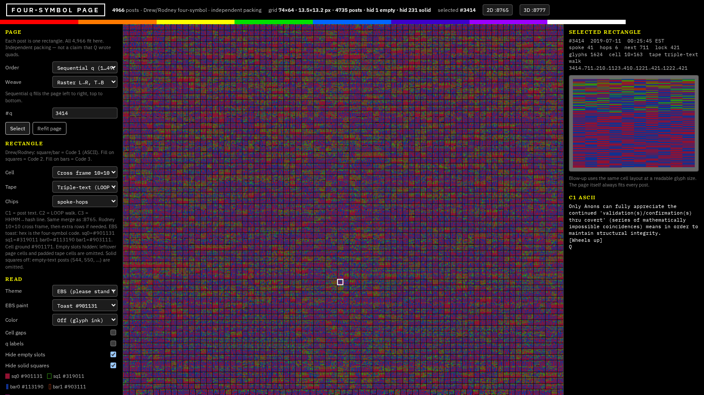
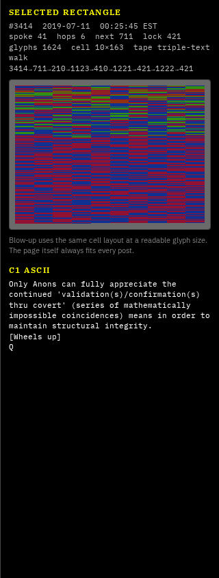
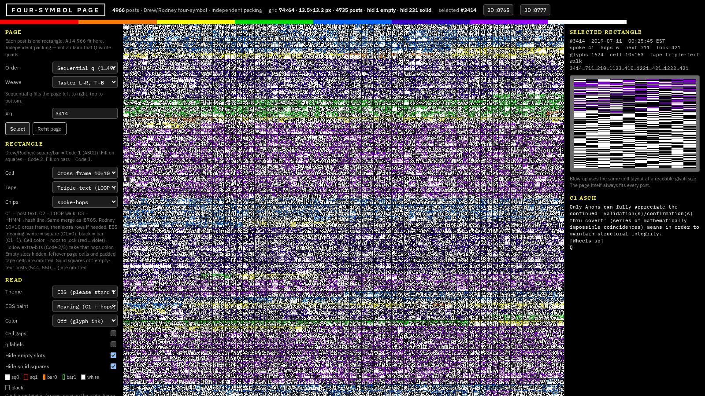
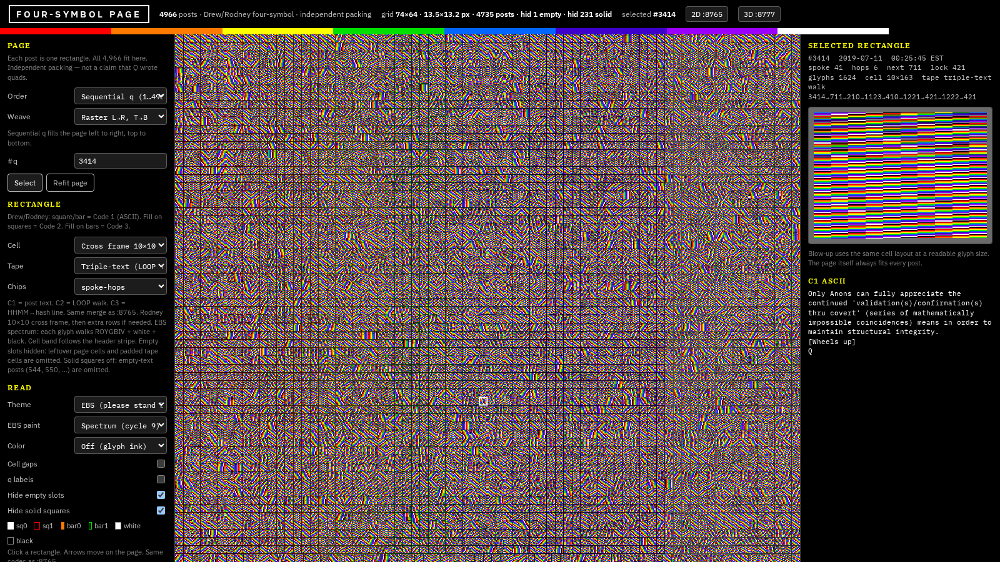
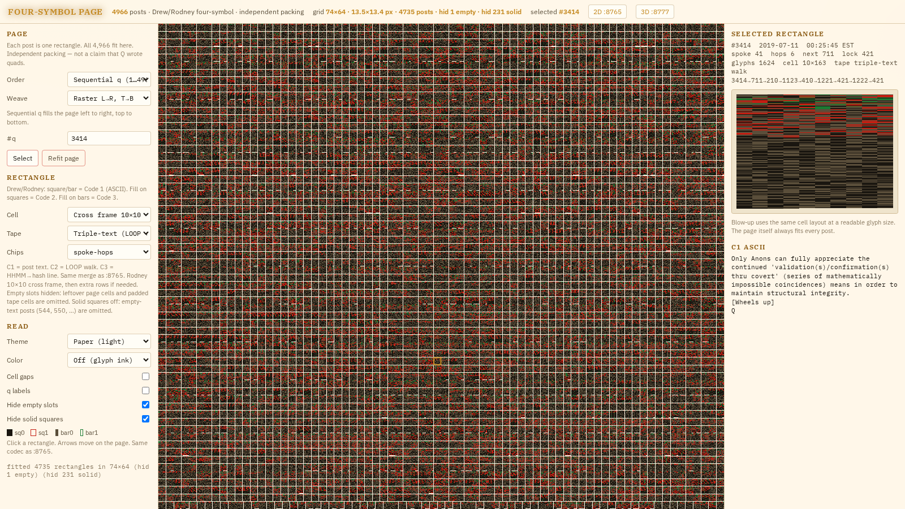
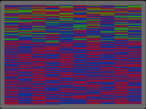
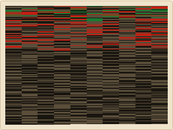
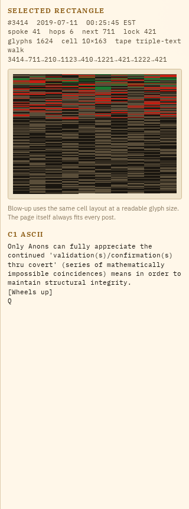

<p align="center">
  
</p>

# Four-symbol page

[](LICENSE)
[](#the-corpus)
[](#run-it)
[](#default-view)

<p align="center">
  <strong><a href="https://kellenheller.github.io/qclock-quads-page/">Open the live page</a></strong>
  ·
  <a href="https://kellenheller.github.io/qclock-quads-page/#q=3414&tape=triple-text&cell=cross&theme=ebs&paint=toast&gaps=0&hide=1&solid=1">Toast</a>
  ·
  <a href="https://kellenheller.github.io/qclock-quads-page/#q=3414&tape=triple-text&cell=cross&theme=ebs&paint=meaning&gaps=0&hide=1&solid=1">Meaning</a>
  ·
  <a href="https://kellenheller.github.io/qclock-quads-page/#q=3414&tape=triple-text&cell=cross&theme=ebs&paint=spectrum&gaps=0&hide=1&solid=1">Spectrum</a>
  ·
  <a href="https://kellenheller.github.io/qclock-quads-page/#q=3414&tape=triple-text&cell=cross&theme=ebs&paint=toast&gaps=0&hide=1&solid=1&fill=1">Filled frame</a>
  ·
  <a href="https://kellenheller.github.io/qclock-quads-page/#q=3414&tape=triple-text&cell=cross&theme=paper">Paper</a>
</p>

One canvas. Every Q post as its own Drew/Rodney rectangle. All **4,966** fit on a single page.

This is an **independent packing** of a public catalog — not a claim that Q wrote quads.

This snapshot matches the local `:8558` four-symbol page.

---

## Default view

Post **#3414** · Paper · cross frame **10×163** · triple-text · cell gaps on.

| | |
|---|---|
| Order | Sequential q |
| Weave | Raster L→R, T→B |
| Picture | Off |
| Cell | Cross frame 10×10 |
| Tape | Triple-text (LOOP + stamp) |
| Layering | Off |
| Theme / paint | Paper · Meaning (paint only applies in EBS) |
| Color | Off (glyph ink) |
| Cell gaps | on |
| Hide empty / solid | off · off |
| Filled frame | off |

Shareable hash (written on load):

```
#q=3414&order=q&weave=raster&cell=cross&tape=triple-text&chips=spoke-hops&color=off&theme=paper&paint=meaning
```

<p align="center">
  
</p>

Toast inks — one hex per mark (EBS Toast paint):

| Glyph | Hex | Role |
|---|---|---|
| sq0 | `#901131` | filled square · C1=0 extra=0 |
| sq1 | `#319011` | hollow square · C1=0 extra=1 |
| bar0 | `#113190` | filled bar · C1=1 extra=0 |
| bar1 | `#903111` | hollow bar · C1=1 extra=1 |
| cell | `#901171` | rectangle ground |

---

## Gallery

Same tape, four looks. Click a shot to open that view.

<p align="center">
  <a href="https://kellenheller.github.io/qclock-quads-page/#q=3414&tape=triple-text&cell=cross&theme=ebs&paint=toast&gaps=0&hide=1&solid=1"></a>
  <a href="https://kellenheller.github.io/qclock-quads-page/#q=3414&tape=triple-text&cell=cross&theme=ebs&paint=meaning&gaps=0&hide=1&solid=1"></a>
</p>
<p align="center">
  <a href="https://kellenheller.github.io/qclock-quads-page/#q=3414&tape=triple-text&cell=cross&theme=ebs&paint=spectrum&gaps=0&hide=1&solid=1"></a>
  <a href="https://kellenheller.github.io/qclock-quads-page/#q=3414&tape=triple-text&cell=cross&theme=paper"></a>
</p>

<p align="center">
  
  &nbsp;
  
  &nbsp;
  
</p>

---

## What you are looking at

Each cell on the page is one post (`q = 1 … 4966`). Inside that cell is a **tape**: the post’s text, plus optional extra channels, drawn with four marks.

Click a rectangle. The right rail blows the same tape up to a readable size and prints the recovered C1 ASCII. Arrow keys walk the page.

### The four marks

Drew / Rodney fashion:

```
C1 bit    extra    glyph     drawing
0         0        sq0       filled square
0         1        sq1       hollow square
1         0        bar0      filled vertical bar
1         1        bar1      hollow / double vertical bar
```

1. **Shape** encodes Code 1 (the ASCII bitstream of the post). Square = `0`, bar = `1`.
2. **Fill** encodes the extra bit. Solid = `0`, hollow = `1`. Extra on squares is Code 2. Extra on bars is Code 3.

**Triple-text** (the default): C1 = post text, C2 = LOOP walk, C3 = HHMM→hash line.

### EBS paints

Theme **EBS** (“please stand by”) has three paints. These are overlays. They do not change the tape.

| Paint | What you see |
| --- | --- |
| **Meaning** | White filled square / black filled bar. Hollow marks take the hops rainbow. |
| **Spectrum** | Every glyph walks ROYGBIV + white + black. Cell band follows the header stripe. |
| **Toast** | Four-symbol hex above, drawn as squares and bars. |

**Filled frame** is a separate toggle (`fill=1`), not an EBS paint. On, the selected rectangle packs as a bitmap (one solid cell per glyph). Off keeps the current blow-up: real squares/bars when they fit, which Toast uses so the four hex inks stay separable.

Other themes: Phosphor, Volt, Magma, Ion, Paper (default), Oak.

---

## Date-hash / LOOP (why 421)

Every post has a calendar date. The **date-key** is EST `MM/DD` with the leading month zero dropped (`2017-12-22` → `1222`). If that number is itself a post index, the catalog walks there. The unique 2-cycle is:

```
421  ↔  1222
```

Depth is at most 6. Display timezone and hash timezone are both `America/New_York`.

| Fact | Value |
| --- | --- |
| Posts | 4,966 |
| Unique dates | 533 |
| First / last | 2017-10-28 → 2022-11-27 |
| Lock pair | 421 ↔ 1222 |
| Lock spoke | 15 |
| Max hops to lock | 6 |

`Color` in the left rail can overlay hops-to-lock, AM/PM, or lock basin. Those paints do not change the tape.

---

## Controls

**Page order** — how the 4,966 rectangles are sequenced onto the grid: sequential q · timestamp · replica date · spoke · hops to lock · time face · date × minute · spoke 15 first · lock basin · AM/PM · even/odd q · LOOP depth · walk-first-visit.

**Weave** — raster, boustrophedon (ox-plow), spiral (outer → in), columns.

**Picture** (separate from Order): off leaves Order + Weave as they are. Any other value locks the page to a **64×74** frame — the packed canvas from Hide empty + Hide solid (4,735 text posts + 1 remainder = 4,736). Glyphs inside each square do not change. Scans: lock 64×74, Morton Z-order, Hilbert, bit-reversal, zig-zag, even/odd interlace, 8×8 blocks, mod-37 interlace, Nipkow polar, shuffle (seed 421). Hash `pic=`.

**Transform** (with Picture on): none, flip H/V, rotate 90/180/270, transpose 74×64. Hash `xform=`. Example: `#q=3414&hide=1&solid=1&pic=morton&xform=transp`.

**Cell packing** — 8-wide byte rows, 32-wide notebook, column-major, boustrophedon, square spiral, weeks (7), nearest square, 8×14 fish frame, 10×10 cross frame.

**Tape** — C1 ASCII (full post) · triple-text · head 8 bytes · field chip (`spoke-hops` / `ampm-lock` / `even-q` / `timehash`).

**Layering** (default Off — the page is unchanged): Peel splits C1/C2/C3 onto inspector plates. **On page** (Peel only) paints those plates under or over every post. Plate mix 0–100 is plate strength. Mute hides sq0/sq1/bar0/bar1 without changing packing. Composite is Solo / Add / Screen / Multiply. Essay loads the TEXTPIC teaching fish/cross into the peek only. **Stack** averages the current cell frame across posts. **Diff** is current Order vs a sibling order as signed gray. Hash `layer=` `onpage=` `mix=` `align=` `comp=` `p1=` `m0=` `essay=` `shuf=` `stack=`.

**Toggles** — cell gaps · q labels · hide empty leftover slots · hide solid squares (image-only / blank posts such as 544 and 550) · filled frame.

State lives in the URL hash, so a view is shareable.

```
#q=3414&cell=cross&tape=triple-text&theme=paper
#q=3414&cell=cross&tape=triple-text&theme=ebs&paint=toast&fill=1
#q=3414&cell=cross&tape=triple-text&theme=paper&layer=peel
#q=3414&cell=fish&layer=peel&align=stream&essay=1
#q=3414&layer=mute&m1=1&m3=1
#q=3414&cell=cross&layer=stack&shuf=1
#q=3414&cell=cross&tape=triple-text&theme=paper&layer=peel&onpage=over
```

---

## Run it

No build step. Python 3 is only the local server (and the tests).

```bash
git clone git@github.com:KellenHeller/qclock-quads-page.git
cd qclock-quads-page
python3 -m http.server 8558 --bind 127.0.0.1
```

Then open [http://127.0.0.1:8558/](http://127.0.0.1:8558/), or skip the clone and use the [live demo](https://kellenheller.github.io/qclock-quads-page/).

```bash
python3 tests/page.py
python3 tests/layers.py
```

`tests/page.py` locks fit / weave / Drew cell packing, toast hex, hide-empty / hide-solid, filled-frame, picture scans, and post **3414** (1624 glyphs, cell 10×163, all four inks).

`tests/layers.py` locks peel / mute / stack / diff math.

---

## Repository map

```
index.html                 four-symbol page
css/page.css               chrome + themes (including EBS toast hex)
js/quads.js                four-symbol codec (pure functions, no DOM)
js/layouts.js              rectangle packing / weaves / picture scans
js/layers.js               peel / mute / stack / diff (pure functions, no DOM)
js/page.js                 four-symbol app
data/corpus.json           4,966 posts + LOOP meta
data/quads-teaching.json   teaching fixture
docs/screenshots/          landing shots
tests/page.py              packing locks
tests/layers.py            layering locks
serve.sh                   local server
```

---

## The corpus

`data/corpus.json` is a catalog of 4,966 public Q posts (2017-10-28 – 2022-11-27) plus the LOOP fields this page needs: `q`, EST timestamp, date, spoke, hops-to-lock, source, and text.

It is included so the demo runs with zero extra fetches. Treat it as **research data**, not as an endorsement of the posts.

---

## What this is not

Not a claim that Q designed four-symbols or this page. It is a packing of a public catalog in Drew/Rodney’s four marks.

---

## License

[MIT](LICENSE) for the code, layout, and this documentation.

The Q post texts in `data/corpus.json` remain the work of their original authors; they are bundled here only so the packing can be opened and inspected.
