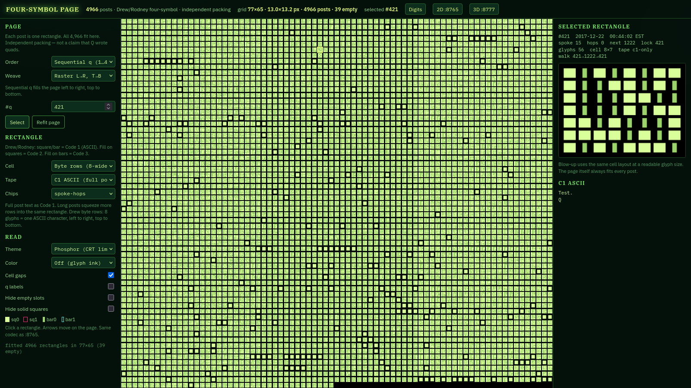
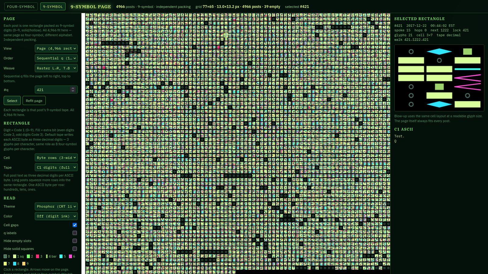
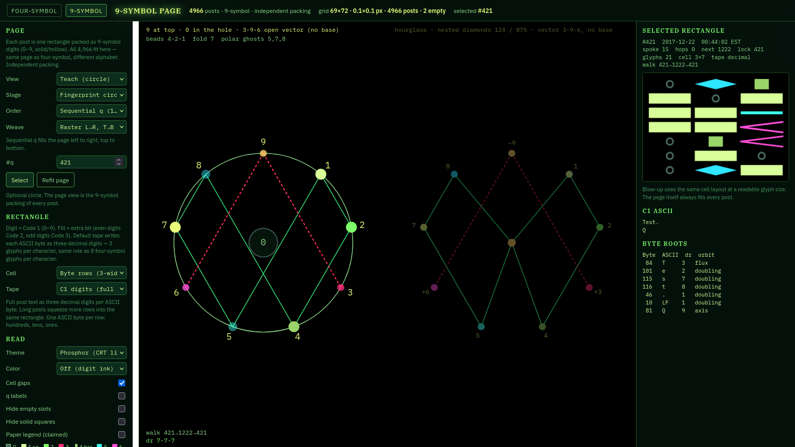

# Four-symbol page

[](LICENSE)
[](#run-it)
[](#the-corpus)
[](https://github.com/ogdonny/qclock-quads-page/actions/workflows/test.yml)

**Live demo:** [ogdonny.github.io/qclock-quads-page](https://ogdonny.github.io/qclock-quads-page/) · [Digits / vortex tab](https://ogdonny.github.io/qclock-quads-page/vortex.html)

One canvas. Every Q post as its own rectangle. All **4,966** fit on a single page.

This is an **independent packing** of a public catalog — not a claim that Q wrote four-symbols, vortex math, or anything else in this codec.



---

## What you are looking at

Each cell on the page is one post (`q = 1 … 4966`). Inside that cell is a **tape**: the post’s text, plus optional extra channels, drawn with a tiny alphabet.

There are two alphabets, two documents, one corpus:

| Tab | File | Alphabet | What a mark means |
| --- | --- | --- | --- |
| **Four-symbol** | [`index.html`](index.html) | square / bar × solid / hollow | Code 1 is a **bit**. Shape = ASCII bit. Fill = extra bit. |
| **Digits / vortex** | [`vortex.html`](vortex.html) | 10 digit shapes × solid / hollow | Code 1 is a **digit 0–9**. Shape = digit. Fill = extra bit. |

Click a rectangle. The right rail blows the same tape up to a readable size and prints the recovered C1 ASCII. Arrow keys walk the page.



---

## Four-symbol codec

Drew / Rodney fashion, same merge as the 2D replica:

```
C1 bit    extra    glyph     drawing
0         0        sq0       filled square
0         1        sq1       hollow square
1         0        bar0      filled bar
1         1        bar1      hollow (double) bar
```

Two channels, one mark:

1. **Shape** encodes Code 1 (the ASCII bitstream of the post). Square = `0`, bar = `1`.
2. **Fill** encodes the extra bit. Solid = `0`, hollow = `1`.
   - Extra on squares is Code 2.
   - Extra on bars is Code 3.

Space bytes (`00100000`) pad Code 1 until there are enough zeros for Code 2 and enough ones for Code 3. Encode and decode are lossless for the ASCII that survives the fold (smart quotes / dashes collapse to ASCII; code points `> 255` become `?`).

Default tape is **C1 ASCII (full post)** — eight glyphs per character, left to right, top to bottom. Long posts squeeze more rows into the same rectangle so the *page* still holds every post.

---

## Digit / vortex codec

Same two-channel idea, upgraded. C1 is no longer a bit; it is a digit `0–9`. Extra stays a bit. Alphabet size: **10 × 2 = 20 glyphs**.

| Digit | Solid | Hollow | Shape | Polar mate | Orbit |
| ---: | --- | --- | --- | ---: | --- |
| 0 | `d0` | `d0h` | ring + center dot (the hole) | 9 | hole |
| 1 | `sq0` | `sq1` | **square** (kept from four-symbol) | 8 | doubling |
| 2 | `ch2` | `ch2h` | chevron out | 7 | doubling |
| 3 | `tr3` | `tr3h` | open triangle | 6 | flux |
| 4 | `bar0` | `bar1` | **bar** (kept from four-symbol) | 5 | doubling |
| 5 | `bar5` | `bar5h` | bar, second stroke | 4 | doubling |
| 6 | `tr6` | `tr6h` | open triangle | 3 | flux |
| 7 | `ch7` | `ch7h` | chevron in | 2 | doubling |
| 8 | `sq8` | `sq8h` | square on the diagonal | 1 | doubling |
| 9 | `ax9` | `ax9h` | empty ring (axis) | 9 / 0 | axis |

Digits **1** and **4** reuse the four-symbol square and bar so the two pages stay visually related. Polar pairs sum to 9. Digital root is residue mod 9, with multiples of 9 written as **9** (and raw 0 kept as the hole).

×2 on ℤ/9ℤ splits the nine nonzero digits into three orbits:

| Orbit | Sequence | Role on this tab |
| --- | --- | --- |
| Doubling circuit | `1 → 2 → 4 → 8 → 7 → 5 → 1` | The thing that **moves** |
| Flux / gap | `3 ↔ 6` | The thing that **governs** |
| Axis | `9 → 9` | Still-point / pad |

Family groups (add 3 to walk forward): **1-4-7**, **2-5-8**, **3-6-9**.

Default tape writes each ASCII byte as **three decimal digits** — 3 glyphs per character, the digit analogue of 8 four-symbol glyphs per character.

The **Teach** view on the digit tab is a legend, not the packing: 9 at the top, 0 in the hole, 3-6-9 as an open vector, and Q post **421** as the worked example (`dr(421) = dr(1222) = 7`, letter `Q` = 81 → 9, spoke 15 → 6).



---

## Date-hash / LOOP (why 421)

Every post has a calendar date. The **date-key** is EST `MM/DD` with the leading month zero dropped (`2017-12-22` → `1222`). If that number is itself a post index, the catalog walks there. The unique 2-cycle is:

```
421  ↔  1222
```

Depth is at most 6. There is no second sink. Display timezone and hash timezone are both `America/New_York`.

| Fact | Value |
| --- | --- |
| Posts | 4,966 |
| Unique dates | 533 |
| First / last | 2017-10-28 → 2022-11-27 |
| Epoch used in the replica | 2017-12-07 |
| Lock pair | 421 ↔ 1222 |
| Lock spoke | 15 |
| Max hops to lock | 6 |

The four-symbol page can color cells by hops-to-lock, AM/PM, or which basin the walk falls into. The digit page can color by orbit, family, or polar pair. Those paints are **overlays**. They do not change the tape.

---

## Controls

Shared on both tabs unless noted.

**Page order** — how the 4,966 rectangles are sequenced onto the grid:

| Order | Meaning |
| --- | --- |
| Sequential q | `1 … 4966` |
| Timestamp | Chronological EST stamps |
| Replica date | Unique posting date, then q |
| Spoke | Clock spoke 0–59 |
| Hops to lock | Depth to 421↔1222, shallow first |
| Time face | Hour, then minute, then second *(four-symbol)* |
| Date × minute | 60×60 layout flattened *(four-symbol)* |
| Spoke 15 first | Lock chapter, then the rest *(four-symbol)* |
| Lock basin | Walks that cadence onto 421, then 1222 |
| AM / PM, even/odd q, LOOP depth, walk-first-visit | as labeled |
| Family / orbit | Digit tab: `1-4-7 / 2-5-8 / 3-6-9` and doubling / flux / axis |

**Weave** — how that sequence fills the page: raster, boustrophedon (ox-plow), spiral (outer → in), columns.

**Cell packing** — how one post’s tape is laid out *inside* its rectangle: 8-wide byte rows, 32-wide notebook, column-major, boustrophedon, square spiral, weeks (7), nearest square, 8×14 fish frame, 10×10 cross frame. Digit tab adds 3-wide (one byte) and 9-wide (three bytes).

**Tape**

*Four-symbol:* C1 ASCII (full post) · triple-text (LOOP + stamp as extra channels) · head 8 bytes · field chip (`spoke-hops` / `ampm-lock` / `even-q` / `timehash`).

*Digits:* C1 digits (full post) · head 8 bytes · `q + date-key + HHMMSS` · family chip `dr(q)` · four-symbol glyphs painted by byte-root.

**Theme:** Phosphor (default CRT lime), Volt, Magma, Ion, EBS, Paper, Oak. EBS has a paint toggle: meaning / spectrum / toast.

**Toggles:** cell gaps · q labels · hide empty leftover slots · hide solid squares (image-only / blank posts such as 544 and 550).

State is stored in the URL hash, so a view is shareable:

```
index.html#q=421&order=basin&theme=phosphor
vortex.html#q=421&view=teach&color=orbit
```

---

## Run it

No build step. Python 3 is only the local server (and the tests).

```bash
git clone git@github.com:ogdonny/qclock-quads-page.git
cd qclock-quads-page
python3 -m http.server 8558 --bind 127.0.0.1
```

Then open [http://127.0.0.1:8558/](http://127.0.0.1:8558/) and [http://127.0.0.1:8558/vortex.html](http://127.0.0.1:8558/vortex.html).

`./serve.sh` does the same thing, and on this machine will prefer the systemd unit `qclock-quads-page.service` if it is installed.

Or skip the clone and use the [live GitHub Pages demo](https://ogdonny.github.io/qclock-quads-page/).

---

## Tests

```bash
python3 tests/page.py      # four-symbol fit / weave / Drew packing
python3 tests/vortex.py    # 9-symbol codec, 421 teaching facts, JS round-trip
```

Frozen facts the digit tests pin down (among others):

- `dr(421) = dr(1222) = 7`, `dr(1221) = 6`, `dr(0) = 0`
- Polar pairs are involutions summing to 9
- `"Test.\nQ"` byte-roots are `3 2 7 8 1 1 9` (letter Q is axis 9)
- ASCII ↔ three-digit tape round-trips

---

## Repository map

```
index.html                 four-symbol page
vortex.html                9-symbol / vortex page
css/page.css               shared CRT chrome + themes
css/vortex.css             digit inks, tab nav, teach layout
js/quads.js                four-symbol codec (pure functions, no DOM)
js/layouts.js              rectangle packing / weaves
js/page.js                 four-symbol app
js/vortex.js               digit codec (own digital-root helper)
js/vortex-page.js          digit app
data/corpus.json           4,966 posts + LOOP meta
data/quads-teaching.json   four-symbol teaching fixture
data/vortex-teaching.json  421 teaching fixture
tests/                     packing + codec locks
serve.sh                   local server
```

The codec files are **pure**. They do not touch the DOM. The page scripts fetch `data/corpus.json` and blit glyphs onto a canvas so the whole catalog stays on one screen.

Sister local apps (not in this repo): 2D replica on `:8765`, 3D analyzer on `:8777`. Header links to those only appear when you are on localhost.

---

## The corpus

`data/corpus.json` is a catalog of 4,966 public Q posts (2017-10-28 – 2022-11-27) plus the LOOP fields this page needs: `q`, EST timestamp, date, spoke, hops-to-lock, source, and text.

It is included so the demo runs with zero extra fetches. Treat it as **research data**, not as an endorsement of the posts.

---

## What this is not

- Not a claim that Q designed four-symbols, Rodin / vortex mathematics, or this page.
- Not a claim that `3 ↔ 6` is `421 ↔ 1222`, or that 9 is *c*. Those are different objects that can be **drawn together**.
- Not a physics or overunity argument. The digit tab uses the *arithmetic* of digital roots and ×2 mod 9. It refuses the cosmology.
- Base-10 is the catalog’s writing system, not a cosmic primitive. In another base the cycle is mod *(b − 1)*.

---

## License

[MIT](LICENSE) for the code, layout, and this documentation.

The Q post texts in `data/corpus.json` remain the work of their original authors; they are bundled here only so the packing can be opened and inspected.
